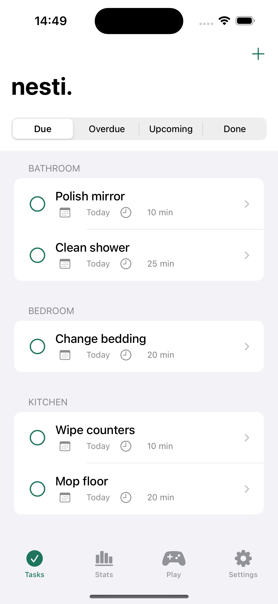
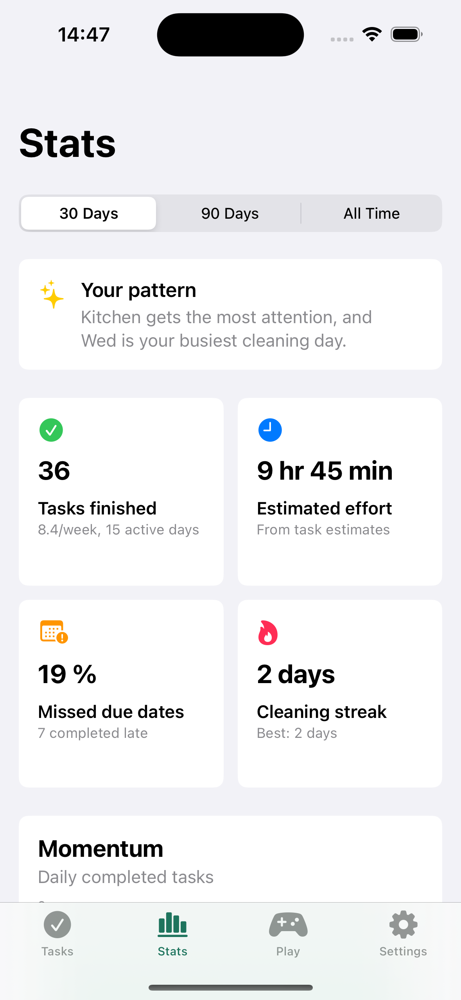
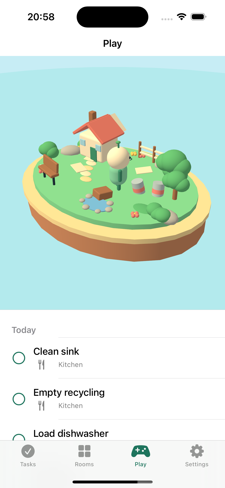

# nesti.

`nesti.` is an offline-first cleaning routine project. The monorepo currently contains the iPhone, iPad, and Mac app built with SwiftUI and SwiftData, with space reserved for a future Astro web app. The native app organizes recurring cleaning tasks by room, highlights what is due, turns daily chores into a small cleanup game, and reveals patterns in when and how you clean. Import and export remain first-class workflows.

## Screenshots

| Tasks | Stats | Play |
| --- | --- | --- |
|  |  |  |

## Cleaning insights

Stats turns local completion history into useful patterns without analytics or an account. Compare the last 30 days, 90 days, or all time to see completed and missed tasks, estimated effort, cleaning streaks, room and task rankings, daily momentum, preferred weekdays and times of day, and whether you tend to clean in one burst or spread tasks across the day.

> **Tip:** Walk through your home while dictating rooms, cleaning tasks, and preferred timing to an AI assistant of your choice. Ask it to generate a `.nesti` JSON file using the template below, then import that file into nesti. to set up your complete routine at once.

## AI-generated plan template

Give the following template to your AI assistant together with your dictated requirements. Ask it to return only valid JSON, keep `version` set to `1`, distribute `nextDueDate` values so tasks do not all begin on the same day, and save the result with a `.nesti` extension.

```json
{
  "version": 1,
  "name": "My Home",
  "metadata": {
    "generator": "AI assistant",
    "notes": "Cleaning plan generated from a walkthrough"
  },
  "rooms": [
    {
      "name": "Bathroom",
      "icon": "shower",
      "notes": "Upstairs bathroom",
      "sortOrder": 0,
      "tasks": [
        {
          "name": "Clean shower",
          "notes": "Include the drain and glass doors",
          "estimatedMinutes": 15,
          "sortOrder": 0,
          "nextDueDate": "2026-09-01",
          "schedule": {
            "type": "interval",
            "days": 7,
            "basis": "completion"
          },
          "reminder": {
            "enabled": true,
            "hour": 9,
            "minute": 0
          }
        },
        {
          "name": "Mop floor",
          "estimatedMinutes": 10,
          "sortOrder": 1,
          "nextDueDate": "2026-09-03",
          "schedule": {
            "type": "weekdays",
            "days": ["wednesday", "saturday"]
          }
        },
        {
          "name": "Clean radiator",
          "estimatedMinutes": 20,
          "sortOrder": 2,
          "nextDueDate": "2026-09-06",
          "schedule": {
            "type": "monthly",
            "intervalMonths": 6,
            "basis": "completion"
          }
        },
        {
          "name": "Wash walls",
          "estimatedMinutes": 30,
          "sortOrder": 3,
          "nextDueDate": "2026-09-15",
          "schedule": {
            "type": "monthly",
            "day": 15,
            "intervalMonths": 1,
            "basis": "scheduled"
          }
        }
      ]
    }
  ]
}
```

Identifiers and export timestamps are optional for generated files; nesti. creates them during import. See the full [`.nesti` format specification](docs/NESTI_FORMAT.md) for field limits and recurrence behavior.

## Requirements

- Xcode 16 or newer
- iOS 17 or newer
- macOS 14 or newer for the Mac Catalyst build
- A development team selected in Xcode for device deployment

## Run

1. Open `ios/nesti.xcodeproj` in Xcode.
2. Select the `nesti` scheme.
3. Choose an iOS simulator or `My Mac (Mac Catalyst)` as the run destination.
4. Build and run.

The portable schedule and file-format tests can also run without Xcode:

```sh
swift test --package-path ios
```

## Structure

- `ios`: native app, widget extension, Swift package, tests, tools, samples, and assets
- `ios/Sources/NestiCore`: recurrence engine, versioned document schema, and validation
- `ios/nesti/Data`: SwiftData models and document mapping
- `ios/nesti/Services`: notifications and import/export support
- `ios/nesti/Features`: SwiftUI screens grouped by workflow
- `ios/Tests/NestiCoreTests`: portable unit tests
- `web`: reserved for the future Astro and Docker application
- `docs`: repository-wide architecture and `.nesti` format specification

See `docs/ARCHITECTURE.md` and `docs/NESTI_FORMAT.md` for design details.
