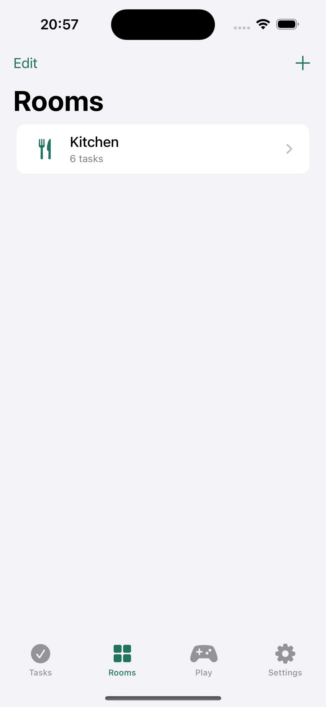

# nesti.

`nesti.` is an offline-first iPhone, iPad, and Mac cleaning routine app built with SwiftUI and SwiftData. It organizes recurring cleaning tasks by room, highlights what is due, sends local reminders, and treats import/export as a first-class workflow.

## Screenshots

| Play | Tasks | Rooms |
| --- | --- | --- |
|  |  |  |

> **Tip:** Walk through your home while dictating rooms, cleaning tasks, and preferred timing to an AI assistant of your choice. Ask it to generate a `.nesti` JSON file using the template below, then import that file into nesti. to set up your complete routine at once.

## AI-generated plan template

Give the following template to your AI assistant together with your dictated requirements. Ask it to return only valid JSON, keep `version` set to `1`, distribute `nextDueDate` values so tasks do not all begin on the same day, and save the result with a `.nesti` extension.

```json
{
  "version": 1,
  "name": "My Home",
  "metadata": {
    "generator": "AI assistant",
    "notes": "Cleaning plan generated from a walkthrough"
  },
  "rooms": [
    {
      "name": "Bathroom",
      "icon": "shower",
      "notes": "Upstairs bathroom",
      "sortOrder": 0,
      "tasks": [
        {
          "name": "Clean shower",
          "notes": "Include the drain and glass doors",
          "estimatedMinutes": 15,
          "sortOrder": 0,
          "nextDueDate": "2026-09-01",
          "schedule": {
            "type": "interval",
            "days": 7,
            "basis": "completion"
          },
          "reminder": {
            "enabled": true,
            "hour": 9,
            "minute": 0
          }
        },
        {
          "name": "Mop floor",
          "estimatedMinutes": 10,
          "sortOrder": 1,
          "nextDueDate": "2026-09-03",
          "schedule": {
            "type": "weekdays",
            "days": ["wednesday", "saturday"]
          }
        },
        {
          "name": "Clean radiator",
          "estimatedMinutes": 20,
          "sortOrder": 2,
          "nextDueDate": "2026-09-06",
          "schedule": {
            "type": "monthly",
            "intervalMonths": 6,
            "basis": "completion"
          }
        },
        {
          "name": "Wash walls",
          "estimatedMinutes": 30,
          "sortOrder": 3,
          "nextDueDate": "2026-09-15",
          "schedule": {
            "type": "monthly",
            "day": 15,
            "intervalMonths": 1,
            "basis": "scheduled"
          }
        }
      ]
    }
  ]
}
```

Identifiers and export timestamps are optional for generated files; nesti. creates them during import. See the full [`.nesti` format specification](docs/NESTI_FORMAT.md) for field limits and recurrence behavior.

## Requirements

- Xcode 16 or newer
- iOS 17 or newer
- macOS 14 or newer for the Mac Catalyst build
- A development team selected in Xcode for device deployment

## Run

1. Open `nesti.xcodeproj` in Xcode.
2. Select the `nesti` scheme.
3. Choose an iOS simulator or `My Mac (Mac Catalyst)` as the run destination.
4. Build and run.

The portable schedule and file-format tests can also run without Xcode:

```sh
swift test
```

## Structure

- `Sources/NestiCore`: recurrence engine, versioned document schema, and validation
- `nesti/Data`: SwiftData models and document mapping
- `nesti/Services`: notifications and import/export support
- `nesti/Features`: SwiftUI screens grouped by workflow
- `Tests/NestiCoreTests`: portable unit tests
- `docs`: architecture and `.nesti` format specification

See `docs/ARCHITECTURE.md` and `docs/NESTI_FORMAT.md` for design details.
